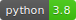
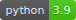

# Usage

left click on the grid <=> set / unset cell
left click on clear <=> clear the playfield
left click on random <=> fill the playfield with random seed

right click anywhere <=> simulate one generation step

